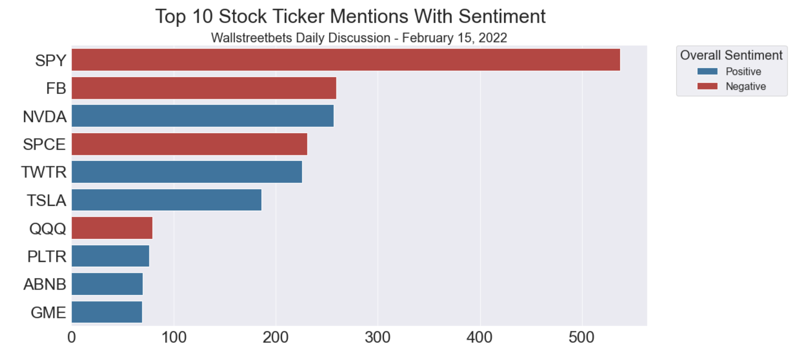
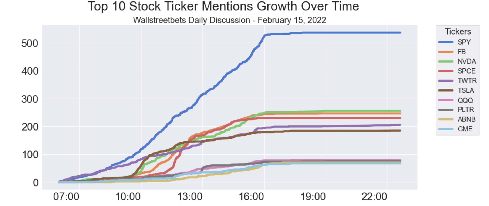
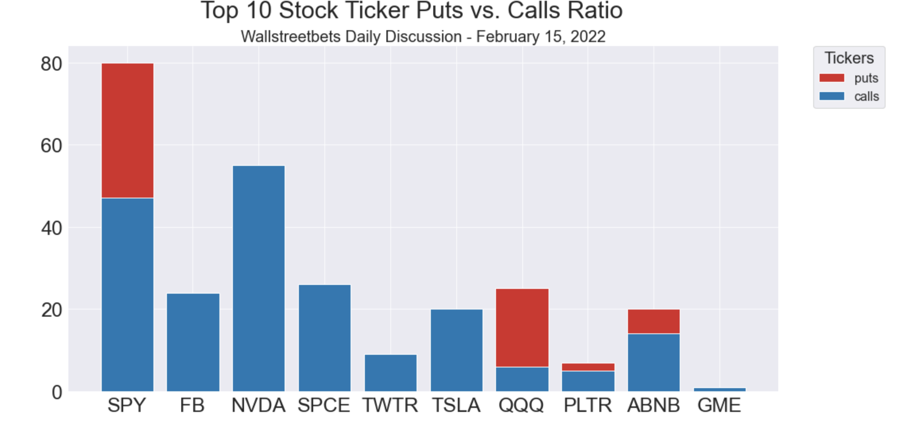

# Stock Scraper Program Tutorial

## Scraping Stocks on Reddit
In this tutorial, I demonstrate my Stock Scraper program. This program scrapes comments and posts from Reddit, extracts and counts Stock Ticker mentions and then displays data visualizations and overall sentiment.

## Sample Visualizations
The visualziations consist of further information on the Top 10 most mentioned tickers. This includes sentiment, a time series graph, and a Call's vs Put's graph. In some Threads, tickers can be mentioned upwards of a thousand times and understanding more about these ticker mentions can prove invaluable. The overall sentiment can help the user gain insight into whether the majority of posts are positive or negative. The Put's vs. Call's can illustrate this a bit further to see the ratio between the two stock contract options. The time series graph helps the user see that as the day progresses, how the ticker mentions grow when compared to each other. The stock market can swing wildly through out the day, and based on timing of the mentions, this can be potentially visualized purely on mentions. 

Below are sample visualzations to illustrate the knowledge that can be gained from using this program.

